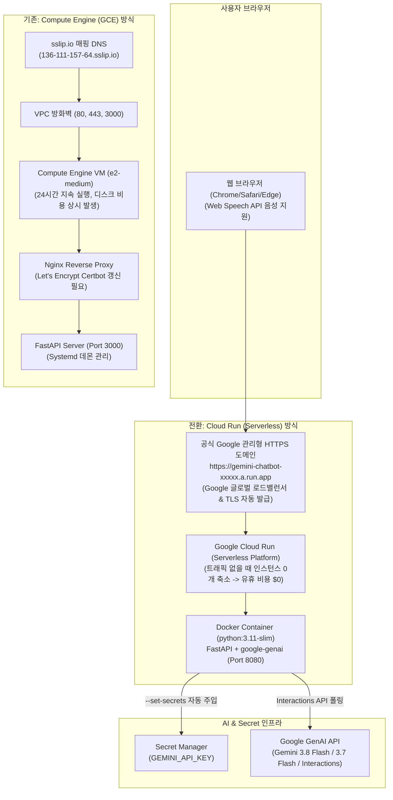

# Google Cloud Run 서버리스 Gemini 챗봇

Google Cloud Run(완전 관리형 서버리스 컨테이너) 환경에서 동작하도록 최적화된 **Google Gemini 3.8 Flash & 3.7 Flash 대화형 AI 웹 챗봇**입니다.

기존 Compute Engine(가상 머신, Nginx 리버스 프록시, Certbot SSL) 아키텍처의 복잡성을 제거하고, **Google 관리형 자동 HTTPS**, **0개로 축소(Scale-to-Zero)를 통한 비용 절감**, **원클릭 소스 기반 컨테이너 배포**를 지원합니다.

---

## 🏗️ 아키텍처 비교: Compute Engine vs Cloud Run



---

## 💎 Cloud Run 전환 시 핵심 장점

| 구분 | Compute Engine (기존) | Cloud Run (전환 후) |
| :--- | :--- | :--- |
| **비용 모델** | 인스턴스/디스크 24시간 고정 청구 (월 ~$25+) | **Scale-to-Zero 지원 (유휴 시간 비용 $0)** |
| **SSL/HTTPS** | Nginx + Certbot 수동 구성 및 cron 갱신 필요 | **Google에서 전 세계 유효 공인 SSL 인증서 100% 자동 관리** |
| **서버 관리** | OS 업데이트, 보안 패치, systemd 관리 필요 | **NoOps (컨테이너 이미지만 실행, 인프라 관리 불필요)** |
| **스케일링** | 트래픽 폭증 시 수동 리사이징 또는 복잡한 MIG 구성 | **트래픽 증가 시 1초 내 수십~수백 개 컨테이너 자동 확장** |
| **API 키 보안** | VM 메타데이터 / 인스턴스 내 파일 보관 | **Cloud Run `--set-secrets` 플래그로 런타임 환경변수 직결** |
| **동적 도메인 대응** | 고정 IP 기반 URL 하드코딩 리다이렉트 | **동적 호스트 자동 HTTPS 감지 및 리다이렉트** |

---

## 📁 디렉터리 구성

```text
cloud_run/
├── Dockerfile                  # Cloud Run 표준 사양 컨테이너 빌드 명세서 (Python 3.11-slim)
├── .dockerignore               # 컨테이너 빌드 시 불필요 파일 제외 목록
├── requirements.txt            # Python 의존성 라이브러리 목록
├── server.py                   # FastAPI 기반 챗봇 서버 (Cloud Run $PORT & 헬스체크 지원)
├── deploy.py                   # Python 기반 크로스 플랫폼 1-Click 자동 배포 스크립트
├── deploy.ps1                  # Windows PowerShell 1-Click 자동 배포 스크립트
├── deploy.sh                   # Linux / macOS Bash 1-Click 자동 배포 스크립트
├── cloud_run_example.ipynb     # Cloud Run 배포, 상태 검증, 대화 테스트 실습 주피터 노트북
├── .env.example                # 로컬 테스트용 환경변수 템플릿
├── public/                     # 정적 웹 애플리케이션 리소스
│   ├── index.html              # Gemini 웹 UI 레이아웃 (동적 HTTPS 전환 적용)
│   ├── style.css               # Google Gemini 공식 Aurora 테마 CSS
│   └── app.js                  # 챗봇 상태 관리, 모델 전환, 음성 인식(Web Speech API)
└── README.md                   # Cloud Run 운영 및 배포 기술 문서
```

---

## 🚀 배포 방법 (3가지 방식 지원)

사전에 `gcloud auth login`을 통해 GCP 계정에 로그인되어 있어야 합니다.

### 방법 1. Python 자동 배포 스크립트 실행 (권장, 크로스 플랫폼)

```bash
cd cloud_run
python deploy.py
```
*스크립트가 프로젝트 설정(`sesac-dev-400904`), 필수 API 활성화, 서비스 계정 권한 바인딩, 컨테이너 빌드 및 배포, 서비스 URL 조회를 자동으로 일괄 수행합니다.*

### 방법 2. Windows PowerShell 원클릭 실행

```powershell
cd cloud_run
.\deploy.ps1
```

### 방법 3. gcloud CLI 직접 실행

```bash
cd cloud_run

# 1. 필수 API 활성화
gcloud services enable run.googleapis.com cloudbuild.googleapis.com secretmanager.googleapis.com

# 2. Cloud Run 서비스 배포
gcloud run deploy gemini-chatbot \
  --source=. \
  --project=sesac-dev-400904 \
  --region=us-central1 \
  --platform=managed \
  --allow-unauthenticated \
  --min-instances=0 \
  --max-instances=5 \
  --memory=1Gi \
  --cpu=1 \
  --timeout=120 \
  --set-secrets="GEMINI_API_KEY=GEMINI_API_KEY:latest"
```

배포가 완료되면 터미널에 발급된 고유 HTTPS URL(예: `https://gemini-chatbot-xxxxxxxxxx-uc.a.run.app`)이 출력됩니다.

---

## 🐳 로컬 환경 테스트 방법

### 1. 로컬 Python 직접 실행
```bash
cd cloud_run
pip install -r requirements.txt
export GEMINI_API_KEY="your_api_key_here"  # Windows PowerShell: $env:GEMINI_API_KEY="your_api_key_here"
python server.py
```
브라우저에서 `http://localhost:8080` 접속

### 2. 로컬 Docker 컨테이너 실행
```bash
cd cloud_run
docker build -t gemini-chatbot-cr .
docker run -p 8080:8080 -e GEMINI_API_KEY="your_api_key_here" gemini-chatbot-cr
```
브라우저에서 `http://localhost:8080` 접속

---

## 🩺 주요 엔드포인트 및 모니터링

- **웹 애플리케이션 UI**: `GET /`
- **Cloud Run 헬스체크 프로브**: `GET /health`
  ```json
  {"status": "healthy", "service": "gemini-chatbot-cloud-run", "environment": "cloud-run"}
  ```
- **API 및 모델 상태 조회**: `GET /api/status`
- **챗봇 대화 질의 API**: `POST /api/chat`
  ```json
  {
    "input": "오늘 주요 IT 뉴스를 알려줘.",
    "model": "gemini-3.8-flash"
  }
  ```

---

## ❓ 트러블슈팅

1. **Secret Manager 권한 오류 (`PermissionDenied` / `secretAccessor`)**
   - Cloud Run의 서비스 계정(`[PROJECT_NUMBER]-compute@developer.gserviceaccount.com`)에 `roles/secretmanager.secretAccessor` 역할이 부여되어 있는지 확인합니다:
   ```bash
   gcloud projects add-iam-policy-binding sesac-dev-400904 \
     --member="serviceAccount:902882112756-compute@developer.gserviceaccount.com" \
     --role="roles/secretmanager.secretAccessor"
   ```

2. **요청 타임아웃 (Timeout 504)**
   - Gemini의 복잡한 사고 과정(Thinking) 및 웹 검색/코드 실행 연동 시 응답 시간이 30초 이상 소요될 수 있습니다. `deploy.py` 및 Cloud Run 설정에서 `--timeout=120`(초)으로 넉넉하게 설정되어 있습니다.

3. **마이크 음성 인식(Web Speech API) 권한**
   - Chrome 및 주요 모던 브라우저는 HTTPS 환경에서만 마이크 API 사용을 허용합니다. Cloud Run은 기본적으로 전 세계 신뢰할 수 있는 Google 관리형 HTTPS로 서비스되므로 별도 도메인 인증서 설정 없이 즉시 마이크 음성 입력이 정상 작동합니다.
