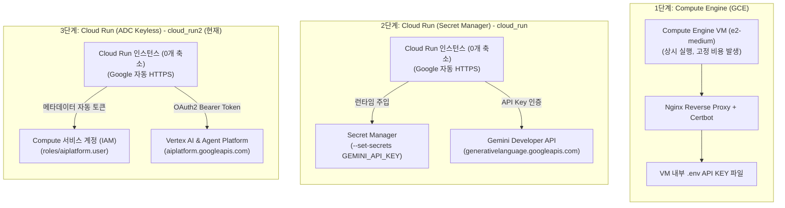

# Google Cloud Run 서버리스 Gemini 챗봇 (ADC 키리스 아키텍처)

Google Cloud Run 환경에서 동작하도록 최적화된 **Google Gemini 3.8 Flash & 3.7 Flash 대화형 AI 웹 챗봇 (ADC 버전)**입니다.

이 프로젝트(`cloud_run2`)는 `cloud_run`에서 사용했던 API 키 및 Secret Manager 주입 방식에서 한 단계 더 나아가, Google Cloud 콘솔의 **[API 액세스 인증]**(`capture.png` 참조)에서 강력히 권장하는 **애플리케이션 기본 사용자 인증 정보(ADC, Application Default Credentials)** 방식을 기반으로 구축되었습니다.

---

## 🎯 핵심 개념: ADC(애플리케이션 기본 사용자 인증 정보)란?

> [!TIP]
> **"ADC is the secure, standard way to connect from company hardware or cloud environments without managing secret keys manually. It automatically uses your environment's existing identity."** (`capture.png` 발췌)

- **완전한 키리스(Keyless) 보안**: 소스 코드나 환경변수, Secret Manager에 API 키 문자열을 저장·관리할 필요가 전혀 없습니다.
- **클라우드 런타임 ID 자동 활용**: Google Cloud Run 내부에서 실행될 때 인스턴스 메타데이터 서버를 통해 기본 Compute Engine 서비스 계정(`{PROJECT_NUMBER}-compute@developer.gserviceaccount.com`)의 IAM 토큰을 자동으로 획득합니다.
- **엔터프라이즈급 권한 제어**: Cloud IAM에서 서비스 계정에 `roles/aiplatform.user` (Vertex AI User) 역할만 바인딩해 두면, 안전하게 Gemini 모델을 호출할 수 있습니다.

---

## 🏗️ 3단계 아키텍처 진화 비교



### 아키텍처별 상세 비교

| 비교 항목 | 1단계 (GCE) | 2단계 (Cloud Run + Secret Manager) | 3단계 (Cloud Run + ADC 권장 방식) |
| :--- | :--- | :--- | :--- |
| **인증 방식** | API 키 파일 보관 | Secret Manager 시크릿 주입 | **ADC (애플리케이션 기본 사용자 인증 정보)** |
| **API 키 노출 위험**| 보통 (VM 접근 시 유출) | 낮음 (Secret Manager 암호화) | **없음 (API 키 자체가 존재하지 않음)** |
| **키 순환/만료 관리**| 수동 파일 수정 | Secret 버전 업데이트 필요 | **Google 관리형 토큰으로 100% 자동 순환** |
| **타깃 플랫폼 API**| Gemini Developer API | Gemini Developer API | **Google Cloud Model API / Vertex AI** |
| **인프라 비용** | 월 ~$25+ (상시 청구) | **$0 (Scale-to-Zero 지원)** | **$0 (Scale-to-Zero 지원)** |
| **추천 대상** | 레거시 VM 환경 | 빠른 프로토타이핑 | **엔터프라이즈 실무 및 프로덕션 환경** |

---

## 📁 디렉터리 구성

```text
cloud_run2/
├── Dockerfile                  # Cloud Run 표준 컨테이너 빌드 명세서 (Python 3.11-slim)
├── .dockerignore               # 컨테이너 빌드 제외 파일 목록
├── requirements.txt            # Python 의존성 라이브러리 (Secret Manager 제외, ADC 지원)
├── server.py                   # FastAPI 백엔드 (ADC 진단, Vertex AI GenAI Client, 도감 챗봇)
├── deploy.py                   # Python 기반 1-Click 자동 배포 스크립트 (IAM 권한 자동 바인딩)
├── deploy.ps1                  # Windows PowerShell 1-Click 자동 배포 스크립트
├── deploy.sh                   # Linux / macOS Bash 1-Click 자동 배포 스크립트
├── cloud_run2_example.ipynb    # ADC 테스트, Vertex AI 호출, Cloud Run 배포 실습 노트북
├── .env.example                # 로컬 개발용 환경변수 템플릿
├── public/                     # 관동지방 포켓몬 도감 프론트엔드 리소스
│   ├── index.html              # 포켓몬 도감 레드 섀시 UI (ADC 상태 칩 적용)
│   ├── style.css               # 포켓몬 도감 스타일시트
│   ├── app.js                  # 챗봇 상태 관리, 모델 전환, Web Speech API 음성 지원
│   └── nurse_joy.jpg           # 간호순 누나 아바타
└── README.md                   # 기술 및 배포 운영 문서
```

---

## 💻 로컬 개발 환경에서 ADC 설정 방법

로컬 PC에서 개발 및 테스트할 때는 아래 2가지 방법 중 하나로 ADC 자격 증명을 획득합니다.

### 방법 A: `gcloud` 표준 명령어로 ADC 로그인 (권장)
```bash
# 1. 브라우저를 통한 Google Cloud ADC 로그인
gcloud auth application-default login

# 2. 할당량(Quota) 프로젝트 지정
gcloud auth application-default set-quota-project iceu-songpa21
```

### 방법 B: `capture.png`의 공식 스크립트 실행 (Linux / macOS / Git Bash)
```bash
bash <(curl -sSL https://storage.googleapis.com/cloud-samples-data/adc/setup_adc.sh)
```
*스크립트가 `gcloud` 설치 확인, ADC 로그인, `aiplatform.googleapis.com` API 활성화, Gemini 테스트 호출까지 일괄 수행합니다.*

### 로컬 서버 실행
```bash
cd cloud_run2
pip install -r requirements.txt
python server.py
```
브라우저에서 `http://localhost:8080`으로 접속하여 포켓몬 도감 UI 및 ADC 상태를 확인합니다.

---

## 🚀 Cloud Run 1-Click 배포 방법

배포 시 `deploy.py`가 자동으로:
1. `aiplatform.googleapis.com` 등 필수 API 활성화
2. Cloud Run 서비스 계정에 `roles/aiplatform.user` 역할 자동 바인딩
3. Secret 설정 없이 소스 기반 컨테이너 빌드 및 배포

### 방법 1: Python 자동 배포 스크립트 (크로스 플랫폼 권장)
```bash
cd cloud_run2
python deploy.py
```

### 방법 2: Windows PowerShell
```powershell
cd cloud_run2
.\deploy.ps1
```

### 방법 3: Linux / macOS Bash
```bash
cd cloud_run2
chmod +x deploy.sh
./deploy.sh
```

---

## 🩺 상태 점검 및 서울 리전 공식 엔드포인트

- **서울 리전 웹 챗봇 공식 접속 주소**: [https://gemini-chatbot-adc-633588962097.asia-northeast3.run.app](https://gemini-chatbot-adc-633588962097.asia-northeast3.run.app)
- **헬스체크**: [https://gemini-chatbot-adc-633588962097.asia-northeast3.run.app/health](https://gemini-chatbot-adc-633588962097.asia-northeast3.run.app/health)
  ```json
  {
    "status": "healthy",
    "service": "gemini-chatbot-cloud-run2-adc",
    "environment": "cloud-run",
    "authMode": "ADC (Application Default Credentials)",
    "adcReady": true,
    "projectId": "iceu-songpa21"
  }
  ```
- **상태 API**: [https://gemini-chatbot-adc-633588962097.asia-northeast3.run.app/api/status](https://gemini-chatbot-adc-633588962097.asia-northeast3.run.app/api/status)
- **리전 정보**: Google Cloud Run 서울 리전 (`asia-northeast3`)
- **인증 모드**: ADC (애플리케이션 기본 사용자 인증 정보, 완전한 키리스 아키텍처)

